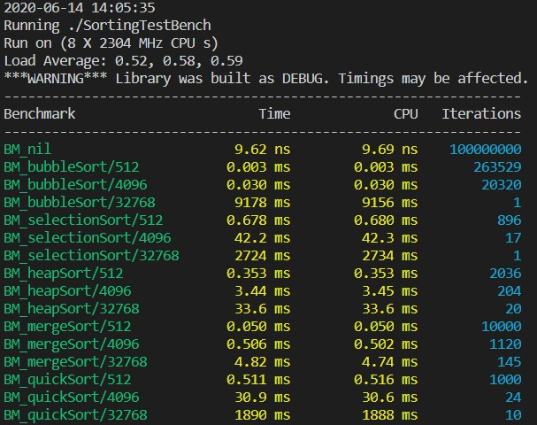

### Comparison of Various Sorting Algorithms in C++

#### INACTIVE PROJECT
I wrote this in the early part of 2016 when I was taking MTE 140 (Data Structures and Algorithms) at UWaterloo. Sorting code has not been substantially modified since then, although I have moved the project to CMake and added benchmarking.

Current algorithms implemented:
- Bubble Sort
- Selection Sort
- Merge Sort
- Heap Sort
- Quicksort

#### Running
1. `cmake .`
2. `make`
3. `./SortingTestBench`

Sample benchmark output:

#### TODO
- Figure out why the 4-year old quicksort code performs so badly compared to heapsort and mergesort
- Counting sort

